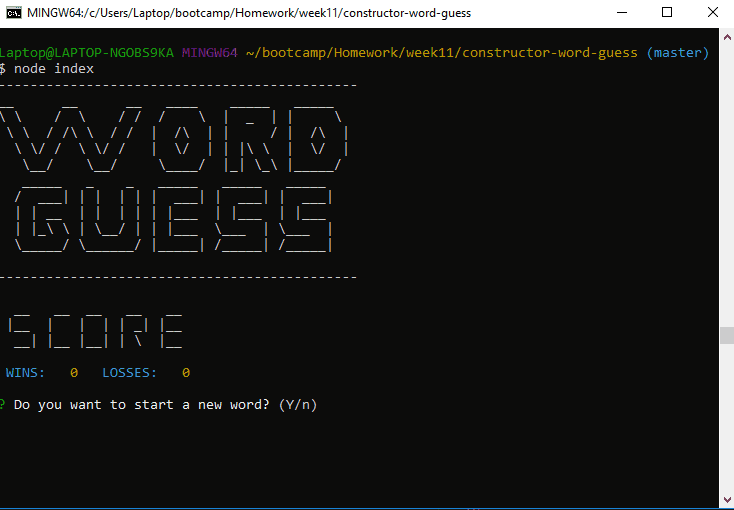
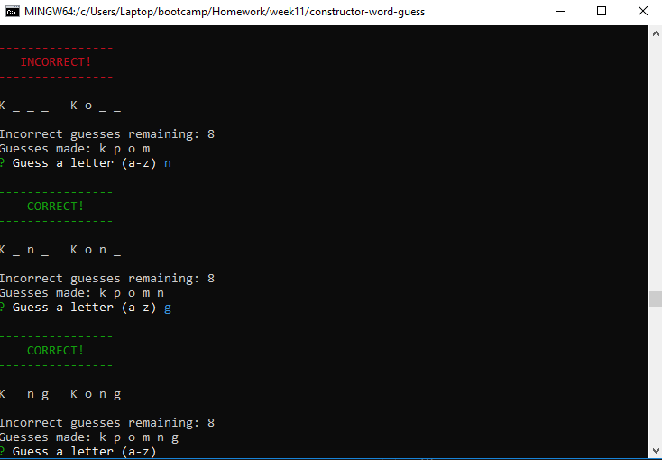

# **Word Guess: Constructors & Node**

## Week 11 Homework Assignment, Coding Boot Camp, UNC-Chapel Hill

Originally submitted on 1/17/2019

### Instructions

- CLI script run via node.js
- Word guessing game, functionally similar to hangman
- Random word is chosen from a selection of movie titles
- Guess a letter (a-z)
- New word is chosen when the user gets it right or gets 10 guesses wrong

### About

Fairly simple word guessing game. The main exercise here was to use constructors to create the word. A word constructor is created with each letter being a constructor as well. Methods are attached to the letters and the word to make the index.js simpler and more readable (and hopefully faster) such as returning if each letter in a word has been correctly guessed or displaying all currently correct letters.

### Example Gifs

Created by Barry Riveroll //
[Github](https://github.com/barryriveroll) //
[Portfolio](https://barryriveroll.github.io/Portfolio/)
